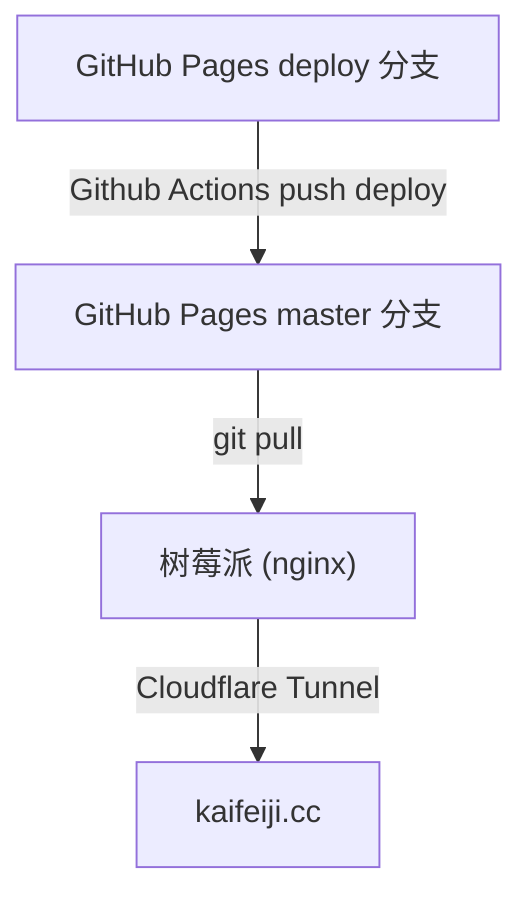

最近在树莓派上折腾 OpenClaw 助手，顺便把博客也迁移过来了，记录一下完整过程。

<!-- more -->


## 整体架构



## 博客托管

博客源码在 GitHub 仓库，通过 GitHub Actions 自动构建并部署到 GitHub Pages。

```.github/workflows/deploy.yml
name: Deploy Hexo Blog

on:
  push:
    branches:
      - deploy

jobs:
  deploy:
    runs-on: ubuntu-latest
    permissions:
      contents: write
    concurrency:
      group: ${{ github.workflow }}-${{ github.ref }}
    steps:
      - uses: actions/checkout@v4
        with:
          ref: ${{ github.ref }}
          token: ${{ secrets.GITHUB_TOKEN }}

      - name: Setup Node
        uses: actions/setup-node@v4
        with:
          node-version: '24'
          cache: 'npm'

      - name: Install Dependencies
        run: npm ci

      - name: Build Hexo
        run: npx hexo generate

      - name: Deploy to GitHub Pages
        uses: peaceiris/actions-gh-pages@v4
        with:
          github_token: ${{ secrets.GITHUB_TOKEN }}
          publish_dir: ./public
          publish_branch: ${{ github.event.repository.default_branch }}
          force_orphan: true
```

## 树莓派同步

在树莓派上 clone 博客仓库：

``` bash
git clone https://github.com/kaifeiji/kaifeiji.github.io.git
```

更新时让 Openclaw 手动 pull一次：

``` bash
git fetch origin
git reset --hard origin/master
```

用 nginx 做静态文件服务：

``` nginx
server {
    listen 80;
    server_name _;
    root /root/kaifeiji.github.io;
    index index.html;
    location / {
        try_files $uri $uri/ =404;
    }
}
```

## 外网暴露

用 Cloudflare Tunnel 将内网服务暴露到公网域名，具体流程自己搜吧，这里不赘述了。
